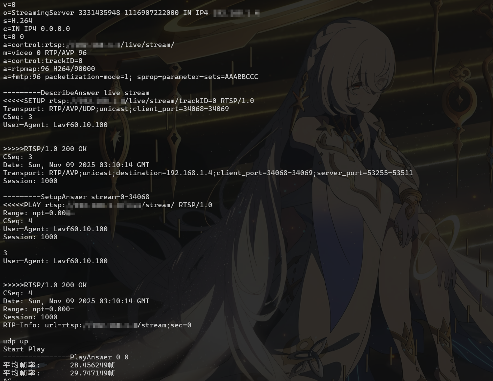

## 支持yolov8识别火焰，并推流
    拉流仓库地址：https://github.com/liuhcl/qt_pull_stream 如果不想配置qt环境，你也可以选择其他的播放器，VLC，ffplay命令（不过这两个延迟会很高）
    默认推流地址：rtmp://你的ip地址/live/stream/（ffmpeg） rtsp://你的ip地址/live/stream/（rtsp）
    该项目使用了两种方式推流，都是mpp h264编码（mpp是从官方移植过来的，删除了一些没用的），720p图像延迟200ms左右，稳定30帧
    `（可能看网络环境，对比在HI3518上测试过延时，延迟确实太高了，还是在局域网内测试的；能力有限，不知道怎么优化；希望有大佬能提供思路）`
## 推流方式：
    一种是ffmpeg + nginx（需要配置环境，先执行nginx，记得配置nginx的rtmp）
    一种是从HI3518移植的rtsp服务器（可直接执行，还以为能够降低延迟，然而还是一样的，但是HI3518延迟就很低100ms内）
## 文件：
    编译文件路径：rknn_yolov8_demo/build-linux_RK3588.sh
    执行文件路径：rknn_yolov8_demo/build/rknn_yolov8_demo 
    模型路径：rknn_yolov8_demo/yolov8_demo/model
    main函数：rknn_yolov8_demo/yolov8_demo/src/main.cc
    mpp：rknn_yolov8_demo/z_rkmpp_enc
## 执行:
```sh
    ./build-linux_RK3588.sh # 编译
    sudo ./rknn_yolov8_demo #执行 如果直接使用移植的rtsp服务器，记得sudo，不然会出现 bind error 的错误
```
## Nginx:
- 编译nginx
```sh
    wget http://nginx.org/download/nginx-1.26.3.tar.gz
    git clone https://github.com/arut/nginx-rtmp-module
    tar -xvf nginx-1.26.3.tar.gz 
    cd nginx-1.26.3/
    ./configure --add-module=../nginx-rtmp-module --with-http_ssl_module 
    make
    sudo make install 
```
- 添加：
    rtmp {
        server {
            listen 1935;
            chunk_size 4000;
            application live {
                live on;
            }
        }
    }
- 启动：
    sudo /usr/local/nginx/sbin/nginx -c /usr/local/nginx/conf/nginx.conf
    查看一下nginx 是否启动 ps -ef | grep nginx
    输入ip地址确定一下是否启动nginx (服务器的地址=本地的ip地址)	 http://192.168.1.1:80
## 运行效果


## 记得点赞